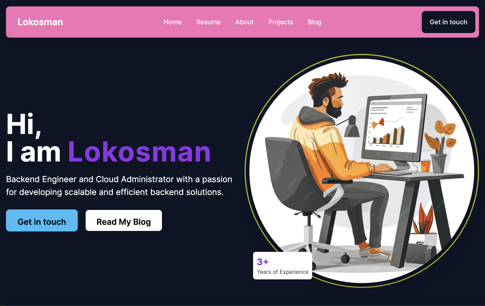
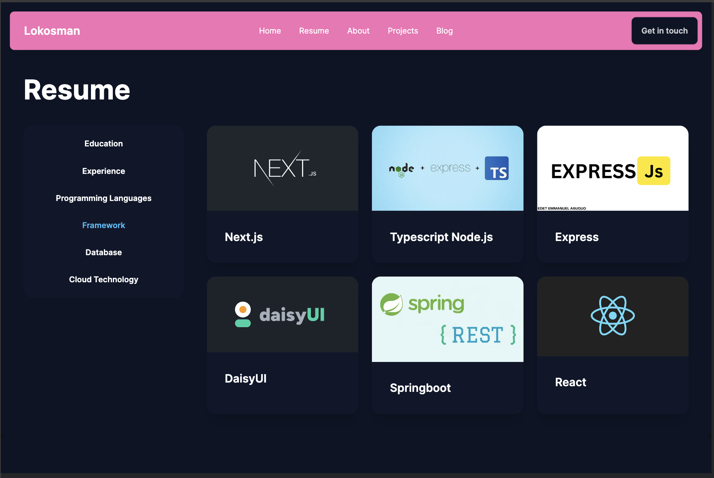
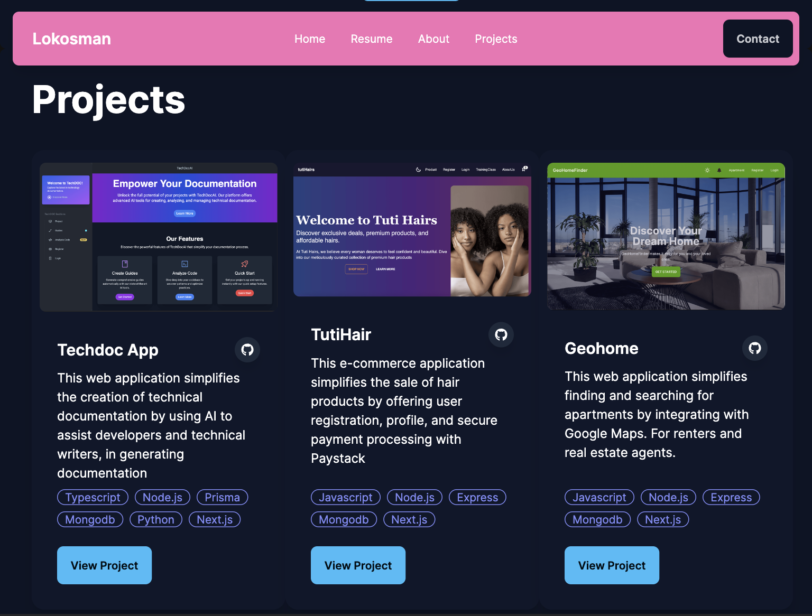
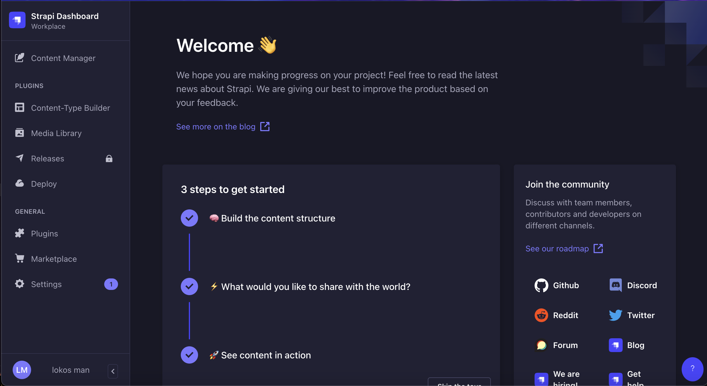

# Lokosman Portfolio

## Introduction

This is my personal portfolio project showcasing my skills, projects, and experiences as a Backend Engineer and Cloud Administrator. The portfolio is built using Next.js and TypeScript, with Strapi serving as the headless CMS. Additionally, it integrates my Hashnode blog using the Blog Starter Kit for seamless blog management and display.

## Features

- **Responsive Design**: The portfolio is fully responsive and works on all device sizes.
- **Strapi CMS**: Manage content such as projects, about me, resume details, and contact messages via Strapi.
- **Hashnode Blog Integration**: Display blog posts from my Hashnode blog directly within the portfolio.
- **Smooth Scrolling**: Smooth scrolling functionality for navigation links.
- **Contact Form**: A modal-based contact form for users to reach out to me.
- **Dynamic Resume**: Tabs to navigate through different sections of my resume including education, experience, programming languages, frameworks, databases, and cloud technologies.
- **Animation**: Subtle animations using Framer Motion.

## Installation
 - Clone the repository
 - Navigate to the project directory
 - Install the dependencies with `npm install`
 - run the application using `npm run dev`

## Project Structure

## Integrating Hashnode Blog

- **Fork the Hashnode Blog Starter Kit repository**: Start by forking the [Hashnode Blog Starter Kit](https://github.com/Hashnode/Blog-Starter-Kit) repository.
- **Deploy it on Vercel**: Create a new project on Vercel and connect your forked repository.
- **Update the environment variables**: In your portfolio project's `next.config.js`, update the environment variables to point to your Vercel deployment URL.
- **Enable headless mode in Hashnode**: Go to your Hashnode blog settings, enable headless mode, and provide the Vercel deployment URL.

## Contact

For any inquiries, please reach out to me via the contact form on the portfolio or through my email: [lokosman5@gmail.com](mailto:lokosman5@gmail.com).

## License

This project is licensed under the MIT License.

